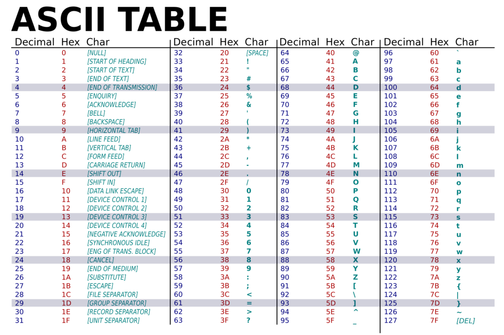

# Типы данных

В Python есть 9 основных *встроенных* типов данных. 
Что такое тип данных? Зайду с далека. Для работы любой программы
нужно уметь управлять сущностями. то есть объектами. 
*В питоне все - есть объект*(к этой фразе мы еще вернемся 
и я подробно объясню что это значит :), а поведение и способности этих 
объектов определяют его тип. 

бля. Эти типы данных делятся на 2 группы: изменяемые и неизменяемые.
ниже в таблице какие изменяемые, а какие нет.
Основное свойство: неизменяемые нельзя изменить после создания)))

В питоне есть еще много ~~нахуй никому не нужных~~ редко используемых типов данных, 
и ты сама можешь создавать свои. 

В таблице описаны эти самые необходимые и самые основные типы данных.
Каждый тип имеет свое назначение и свои полезные(и не очень) методы.

*Моя идея максимально быстро научить тебя писать код(это не сложно),
а потом если получится, научить писать рабочий, красивый, поддерживаемый, 
пиздатый код(я просто сам не умею :). Поэтому сразу разберем все эти типы
данных и закрепим задачкой.*


| Тип         | Неизменяемый | На Слэнге     | Хэшируемый | Ключ словаря |
| ----------- | -----------  | ------------- | ---------- | ------------ |
| `int`       | **Да**       | **-**         | **Да**     | **Да**       |
| `float`     | **Да**       | **-**         | **Да**     | **Да**       |
| `bool`      | **Да**       | **-**         | **Да**     | **Да**       |
| `str`       | **Да**       | **-**         | **Да**     | **Да**       |
| `bytes`     | **Да**       | **-**         | **Да**     | **Да**       |
| `list`      | **Нет**      | **Списки**    | **Нет**    | **Нет**      |
| `tuple`     | **Да**       | **Кортежи**   | **Иногда** | **Иногда**   |
| `set`       | **Нет**      | **Множества** | **Нет**    | **Нет**      |
| `dict`      | **Нет**      | **Словари**   | **Нет**    | **Нет**      |


### int - Числа

Тут все понятно.
Неизменяемый тип данных. 
Можно делить, умножать, складывать, вычитать, возводить в степень, 
считать остаток от деление и делить нацело.
`//, /, %, +, -, *, **`

Задач по этому типу данных не будет)))

### float - Числа с плавующей запятой

Те же яйца, только в профиль.

### bool - Логический тип данных

True, False. всё)

Да не, я угораю. Любое выражение с логической 
опирацией(кроме **or**, но там тоже считается) возвращает
True или False. 

В Python любой объект можно интерпритировать как True или False.
0 и пустые значения интерпритируются как False, остальные как True.

Что я имею ввиду? Пример кода покажет...
```python
if 1:
    print('1 интерпритируется как True')

if not []:
    print('[] - пустой лист интерпритируется как False')

if not '':
    print("'' - пустая строка интерпритируется как False")
```
Так же если наполнить тот же лист элементами или строку символлами, 
они будут интерпритироваться как True

Узнать как будет интерпритироваться тот или иной объект можно функцией
bool. то есть так: `bool(<some object>)`

Тут задач пока не будет)))

### str - Строки

Уже поинтересней.

Строки - это последовательность символов. Обработка текста - относится к списку
типичных задач. Чем бы ты не занималась, всегда понадобится что-нибудь сделать со строкой.
Поэтому тут разберем все что есть, что-то поверхностно 
чтоб ты знала что есть такое и где это искать,
а что-то что по моему опыту всегда пригодится мы разьерем сразу и **глубоко**.

Строки - это последовательность символов. Значит с ними можно использовать индексы
и срезы.
```python
>>> x = "Hello"
>>> x[0]
'H'
>>> x[1:]
'ello'
```

#### Полезные Операции над строками:

- *len* - возвращает длину итерируемого объекта. что такое итерируемый объект 
расскажу в другом уроке.
```python
>>> x = "Hello"
>>> len(x)
5
```

- *+*  Сложение строк

```python
>>> x = "Hello" + " " + "world"
>>> x
'Hello world'
```

- '*' Умножение строк

```python
>>> x = "Hello" * 3
>>> x
'HelloHelloHello'
```
!!! строки можно умножать только на числа.

#### Основные экранированные последовательности:

В Python строки пишутся в одинарных ковычках или в двойных.
Но как поместить одинарную ковычку в строку:
```python
>>> a = 'test'string'

SyntaxError: unterminated string literal (detected at line 1)

>>> a = 'test\'string'
>>> a
"test'string"
```

В первом случае интерпритатор вызывает исключение **SyntaxError**,
он не понимает где кончается строка. На помощь приходит экранирование.

Экранирование - это замена в тексте управляющих символов 
на текстовые подстановки)

Но как тогда вывести символ '\' ? Все очень просто, надо его экранировать:
```python
>>> a = 'Ето слеш - \\'
>>> a
'Ето слеш - \'
```
Хотя можно одинарные ковычки писать в двойных и наоборот)) `a = "'"`

Существует список экранированных символов:

| Последовательность | Символ                              | 
| ------------------ | ----------------------------------- | 
| `\'`               | Одинарная ковычка                   |
| `\"`               | Двойная ковычка                     |
| `\\`               | Обратный слеш                       |
| `\a`               | Звуковой сигнал                     |
| `\b`               | Backspace                           |
| `\f`               | Прогон страницы (хз что это)        |
| `\n`               | Перенос строки                      |
| `\r`               | Возврат курсора (хз что это)        |
| `\t`               | Табуляция                           |
| `\v`               | Вертикальная табуляция (хз что это) |

#### Методы строк

Как я уже говорил, в питоне все - есть объект.
а у объектов есть методы. На разбое темы "классы" ты поймешь 
откуда берутся эты методы))

Наверное тут сразу разберем некоторые полезные свойства строк:
```python
>>> a = b'bytes' # строка байтов
>>> a
b'bytes'
>>> type(a)
<class 'bytes'>

>>> a = r'\n\n\n\n Test Sting \t\b\n' # подавление экранирования
>>> a
'\\n\\n\\n\\n Test Sting \\t\\b\\n'
```
Подавление экранирования чаще всего используется в регулярных выражениях. 
больше информации в главе "Регулярные выражения"

А теперь к методам строк:

| Метод                    | Описание                              | 
| ------------------------ | ----------------------------------- | 
|S.find(str, [start],[end])  |  Поиск подстроки в строке. Возвращает номер первого вхождения или -1|
|S.rfind(str, [start],[end])  |  Поиск подстроки в строке. Возвращает номер последнего вхождения или -1|
|S.index(str, [start],[end])  |  Поиск подстроки в строке. Возвращает номер первого вхождения или вызывает ValueError|
|S.rindex(str, [start],[end])  |  Поиск подстроки в строке. Возвращает номер последнего вхождения или вызывает ValueError|
|S.replace(шаблон, замена[, maxcount])  |  Замена шаблона на замену. maxcount ограничивает количество замен|
|S.split(символ)  |  Разбиение строки по разделителю|
|S.isdigit()  |  Состоит ли строка из цифр|
|S.isalpha()  |  Состоит ли строка из букв|
|S.isalnum()  |  Состоит ли строка из цифр или букв|
|S.islower()  |  Состоит ли строка из символов в нижнем регистре|
|S.isupper()  |  Состоит ли строка из символов в верхнем регистре|
|S.isspace()  |  Состоит ли строка из неотображаемых символов (пробел, символ перевода страницы ('\f'), "новая строка" ('\n'), "перевод каретки" ('\r'), "горизонтальная табуляция" ('\t') и "вертикальная табуляция" ('\v'))|
|S.istitle()  |  Начинаются ли слова в строке с заглавной буквы|
|S.upper()  |  Преобразование строки к верхнему регистру|
|S.lower()  |  Преобразование строки к нижнему регистру|
|S.startswith(str)  |  Начинается ли строка S с шаблона str|
|S.endswith(str)  |  Заканчивается ли строка S шаблоном str|
|S.join(список)  |  Сборка строки из списка с разделителем S|
|ord(символ)  |  Символ в его код ASCII|
|chr(число)  |  Код ASCII в символ|
|S.capitalize()  |  Переводит первый символ строки в верхний регистр, а все остальные в нижний|
|S.center(width, [fill])  |  Возвращает отцентрованную строку, по краям которой стоит символ fill (пробел по умолчанию)|
|S.count(str, [start],[end])  |  Возвращает количество непересекающихся вхождений подстроки в диапазоне [начало, конец] (0 и длина строки по умолчанию)|
|S.expandtabs([tabsize])  |  Возвращает копию строки, в которой все символы табуляции заменяются одним или несколькими пробелами, в зависимости от текущего столбца. Если TabSize не указан, размер табуляции полагается равным 8 пробелам|
|S.lstrip([chars])  |  Удаление пробельных символов в начале строки|
|S.rstrip([chars])  |  Удаление пробельных символов в конце строки|
|S.strip([chars])  |  Удаление пробельных символов в начале и в конце строки|
|S.partition(шаблон)  |  Возвращает кортеж, содержащий часть перед первым шаблоном, сам шаблон, и часть после шаблона. Если шаблон не найден, возвращается кортеж, содержащий саму строку, а затем две пустых строки|
|S.rpartition(sep)  |  Возвращает кортеж, содержащий часть перед последним шаблоном, сам шаблон, и часть после шаблона. Если шаблон не найден, возвращается кортеж, содержащий две пустых строки, а затем саму строку|
|S.swapcase()  |  Переводит символы нижнего регистра в верхний, а верхнего – в нижний|
|S.title()  |  Первую букву каждого слова переводит в верхний регистр, а все остальные в нижний|
|S.zfill(width)  |  Делает длину строки не меньшей width, по необходимости заполняя первые символы нулями|
|S.ljust(width, fillchar=" ")  |  Делает длину строки не меньшей width, по необходимости заполняя последние символы символом fillchar|
|S.rjust(width, fillchar=" ")  |  Делает длину строки не меньшей width, по необходимости заполняя первые символы символом fillchar|
|S.format(*args, **kwargs)  |  Форматирование строки. Больше инфы в разделе ниже) |

Это все методы строк в Python 3.x, хотя в 3.10 может что-то новенькое подъехало)

Все разбирать мы конечно же не будем. Мы будем разбирать только те что могут понадобиться
в реальных задачах или на собесе(некоторые долбаебы вроде Яндекса ебучего попытаются тебя
унизить на тупых алгоритмах. Знаем, плавали...).

- find - поиск))) возвращает номер первого вхождения или -1
```python
>>> a = 'testtest'
>>> a.find('s')
2
```

- rfind - возвращает номер последнего вхождения или -1
```python
>>> a = 'testtest'
>>> a.rfind('s')
6
```

- index - тот же find, только в случае ненахода вызывает исключение ValueError 

- rindex - тот же rfind, только в случае ненахода вызывает исключение ValueError

**Тут надо решить задачку first_last**


- replace - один из способов изменения строк. они неизменяемы, но метод replace создает
и возвращает новую строку
```python
>>> a = 'Hello man'
>>> a = a.replace('man', 'dude')
>>> a
'Hello dude'
```
Применений масса.

- split - разделяет строку по "разделителю" и возвращает список (списки разберем ниже)
```python
>>> a = 'I am groot'
>>> a.split(' ')
['I', 'am', 'groot']
```
Разделили строку по пробелу. Вернул список строк.
Очень полезный метод


- startswith - бесценный метод. Показывает Начинается ли строка с шаблона. Возвращает True или False
```python
>>> a = 'пидор Александр'
>>> if a.startswith('пидор'):
>>>     print('Да Александр у нас глину месить любит')
'Да Александр у нас глину месить любит'
```

- endswith - Показывает Кончается ли строка шаблоном. Возвращает True или False
```python
>>> a = 'image.png'
>>> a.endswith('.png')
True
```
Метод полезен при фильтрации файлов по разширению.

- join - Полезнейщий метод. Объеденяет лист строк в строку по разделителю.
```python
>>> ' '.join(['i', 'am', 'groot'])
'i am groot'
>>> ' и '.join(['яблоки', 'груши', 'персики'])
'яблоки и груши и персики'
```

- ord - Преобразует символ в код ascii

- chr - наоборот код ascii в символ
ascii - это название таблицы, в которой некоторым распространённым 
печатным и непечатным символам сопоставлены числовые коды:


- maketrans, translate - работают в связке. Используются довольно редко. 
Мне еще не довелось использовать) но уверен в некоторых ситуациях могут 
упростить жизнь. метод maketrans создает таблицу преоброзований
по двум аргументам, они должны быть одного размера. таблица устроена так,
что для каждого n-го символа первого аргумента она возвращает n-й символ второго аргумента
```python
>>> a = '1 + 2 (3)'
>>> table = a.maketrans('+()', '-[]')
>>> a.translate(table)
'1 - 2 [3]'
```

**Тут надо решить задачку caesar_cipher**

- count, lstrip, rstrip, strip, swapcase, zfill, rjust, upper, lower - ознакомиться с назначением!

- isdigit, isalpha, isalnum, islower, issuper, isspace, istitle - полезные 
и легкие в освоении методы. Обязательно к ознокомлению.


#### Тут еще задокументировать надо форматирование строк и логические операции со строками.


